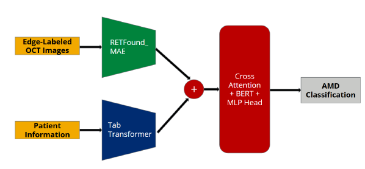
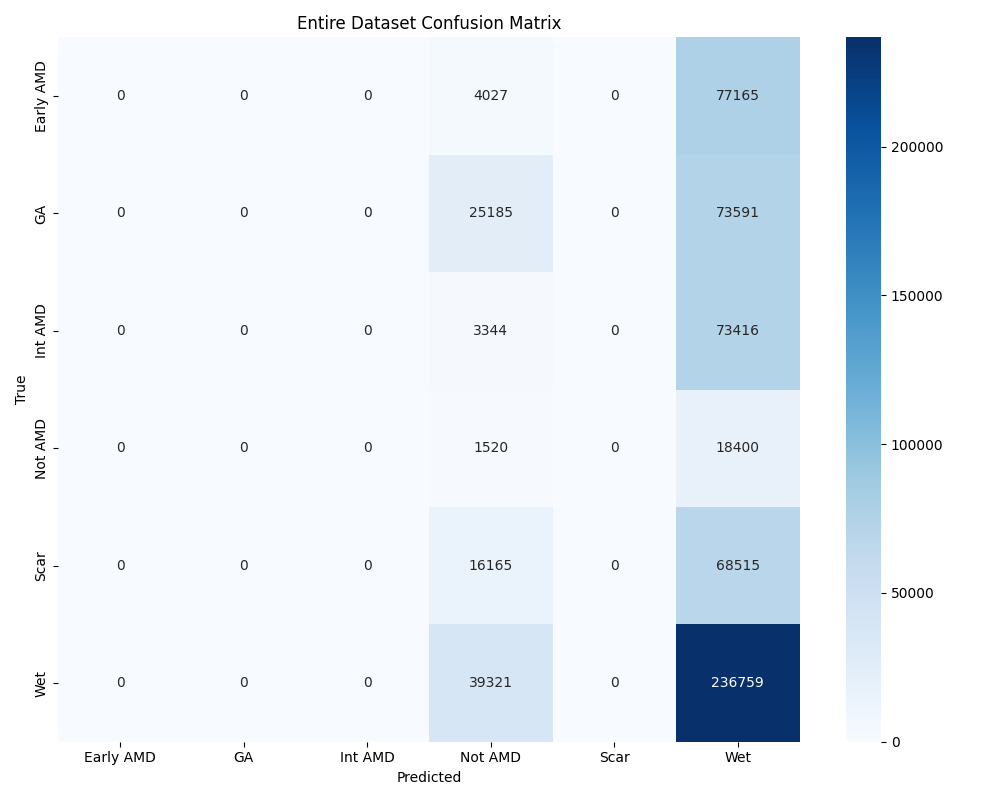
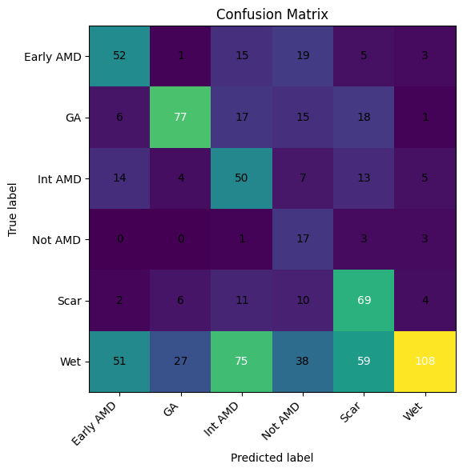

# Multimodal Age-Related Macular Degeneration Classification using OCT imaging and Demographic Tabular Data

## Overview

This term project for the **Projects in Biomedical AI (42-687)** course implements a multimodal deep learning framework that combines optical coherence tomography (OCT) images with structured clinical data to classify age-related macular degeneration (AMD) into six stages: Not AMD, Early AMD, Intermediate AMD, Geographic Atrophy (GA), Scarring, and Wet AMD. The image modality uses a pre-trained RETFound ViT-large encoder, the clinical (tabular) modality uses a gated TabTransformer, and both modalities are fused via a cross-attention module followed by a BERT-style decoder for final classification.

Full report available [here](https://github.com/jtang3-cmu/Multimodal-Classification/blob/main/AIBME_final%20report.pdf).

## Table of Contents

* [Dataset](#dataset)
* [Method](#method)

  * [Image Encoder](#image-encoder)
  * [Tabular Encoder](#tabular-encoder)
  * [Multimodal Architecture](#multimodal-architecture)
* [Results](#results)
* [Project Structure](#project-structure)
* [Acknowledgments](#acknowledgments)
* [Authors](#authors)

---

## Dataset

* **Source**: University of Pittsburgh Medical Center (UPMC) AMD-OCT dataset, provided by the Choroidal Analysis Research Laboratory at UPMC.
* **Size**: 4,028 OCT volumes (≈637,408 B-scan slices) from 91 patients (2007–2023)
* **Labels**: Not AMD, Early AMD, Intermediate AMD, GA, Scarring, Wet AMD

## Method

### Stage Annotation
* Definition: All OCT scans and clinic visit records falling between two consecutive clinical diagnoses are assigned to the earlier AMD stage.

* Procedure: For each patient, sort diagnosis dates chronologically. For each diagnosis date (D_i) corresponding to stage (S_i), label every scan and visit from D_i (inclusive) up to but not including the next diagnosis date D_{i+1} as stage S_i.

* Example: A patient diagnosed with Early AMD on 2020-04-01 and then with Intermediate AMD on 2021-04-01 will have all scans and records between 2020-04-01 and 2021-04-01 (not included) labeled as Early AMD.

### Image Encoder

* **Backbone**: RETFound ViT-large (24-layer Transformer, 1024-dim embeddings), self-supervised pre-trained on 736,442 OCT B-scans.
* **Classification Head**: Frozen backbone + 128-dim projection + ReLU + Dropout → 6-way output.
* **Training**: 10 epochs, batch size 128, Adam lr=1e-4, ReduceLROnPlateau scheduler.

### Tabular Encoder

#### Preprocessing

* **Data Cleaning**: Removed records with >30% missing fields; imputed remaining missing values using median for continuous (age, visual acuity, ICD frequency) and mode for categorical features.
* **Normalization**: Continuous features (age, VA, ICD freq) standardized (zero mean, unit variance) based on training set statistics.
* **Encoding**: Categorical features (gender, smoking, drinking, drug abuse, ICD-10 code groups) label-encoded, then embedded via TabTransformer’s embedding layers.

#### Model & Training

* **Architecture**: Gated TabTransformer with 4 transformer blocks, each containing 4 attention heads and a gating mechanism to control information flow.
* **Hyperparameters**: 200 epochs, batch size 64, Adam optimizer with initial lr=1e-3, StepLR scheduler decaying lr by 0.5 every 40 epochs.
* **Regularization**: Dropout (0.2) applied after each feed-forward layer; early stopping on validation loss with patience of 15 epochs.

### Multimodal Architecture

Below is the high-level architecture diagram illustrating feature extraction, cross-modal fusion, and classification stages.

1. **Feature Extraction**

   * OCT features: RETFound ViT-large → 1024-dim vector
   * Clinical features: TabTransformer → 64-dim vector
2. **Cross-Attention Fusion**

   * Image features (Key/Value, projected to 768-dim)
   * Tabular features (Query, projected to 768-dim)
   * One multi-head cross-attention layer → fused 768-dim representation
3. **BERT Decoder & Classification**

   * Sequence \[Fused, Tabular] → BERT-Base (12 layers, hidden size 768)
   * \[CLS] token → 128-dim MLP → 6-way softmax

Training: Fusion block, BERT decoder, and MLP trained for 10 epochs (batch size 16) while keeping encoders frozen.

## Results

### Image-Only

* **B-scan Accuracy**: 37%

### Tabular-Only

* **Test Accuracy**: 46.3% (imbalance impacted recall on Not AMD)

### Multimodal

* **B-scan Validation Accuracy**: 79.7% (peak at epoch 10)

## Acknowledgments

Collaboration with [Choroidal Analysis Research Laboratory](https://ophthalmology.pitt.edu/research/basic-science-research/laboratories/choroidal-analysis-research-laboratory)

## Authors

* Martin Goessweiner: OCT Image Preprocessing
* Jiayi Liu: Image Encoder
* Jainam Modh: Image Encoder
* Jonathan Tang: Tabular Encoder + Multimodal Training

